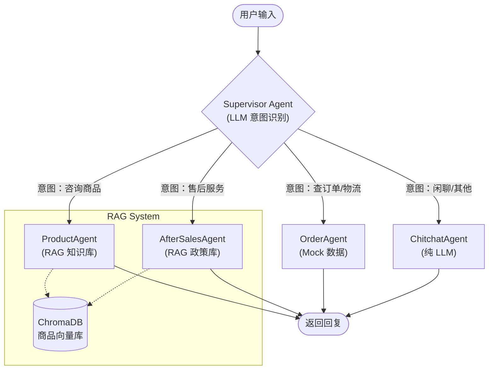

# 智能电商客服 Multi-Agent 系统

基于 LangChain + LangGraph 构建的多 Agent 协作电商客服系统。

## 技术栈

- **LLM 框架**: LangChain, LangGraph
- **后端**: FastAPI, Uvicorn
- **前端**: Streamlit
- **向量数据库**: Chroma
- **缓存**: Redis
- **可观测性**: LangSmith
- **容器化**: Docker

## 项目结构

```
ecommerce-customer-service/
├── src/
│   ├── agents/           # Agent 实现
│   ├── api/              # FastAPI 服务
│   ├── config/           # 配置管理
│   ├── rag/              # RAG 相关（阶段二）
│   ├── graphs/           # LangGraph 工作流（阶段三）
│   ├── tools/            # Agent 工具（阶段四）
│   └── observability/    # 可观测性（阶段五）
├── frontend/             # Streamlit 前端
├── data/                 # 数据文件
└── docs/                 # 文档
```

## 快速开始

### 1. 安装依赖

```bash
pip install -r requirements.txt
```

### 2. 配置环境变量

```bash
cp .env.example .env
# 编辑 .env 文件，填入你的 OpenAI API Key
```

### 3. 启动后端服务

```bash
python -m src.api.main
```

或使用 uvicorn：

```bash
uvicorn src.api.main:app --reload --port 8000
```

### 4. 启动前端界面

```bash
streamlit run frontend/app.py
```

### 5. 访问应用

- 前端界面: http://localhost:8501
- API 文档: http://localhost:8000/docs

## 开发进度

## 系统架构与工作流

本系统采用双模式架构，支持 **Standard Mode (LangGraph 工作流)** 和 **Tool Call Mode (透传模式)**，以适应不同的业务集成需求。

### 核心工作流解析

**Standard Mode (LangGraph Multi-Agent)**

这是系统的默认模式，通过 Supervisor Agent 实现智能路由和多 Agent 协作。

1.  **Start (用户输入)**: 用户发送消息。
2.  **Supervisor Node**:
    *   技术：使用 LLM (Qwen/GPT) 分析用户意图。 (代码: `src/graphs/customer_service_graph.py`)
    *   功能：作为中央路由器，将请求分类为“商品咨询”、“订单查询”、“售后服务”或“闲聊”。
    *   输出：目标 Agent 的名称 (ProductAgent/OrderAgent/AfterSalesAgent/ChitchatAgent)。
3.  **Conditional Edge (条件路由)**:
    *   LangGraph 根据 Supervisor 的输出，将状态流转到对应的 Agent 节点。
4.  **Agent Nodes (子领域专家)**:
    *   **ProductAgent**: 结合 RAG 技术，检索 Chroma 向量库中的商品手册，回答产品问题。
    *   **OrderAgent**: 模拟订单处理逻辑（在 Standard 模式下使用 Mock 数据），查询订单状态和物流。
    *   **AfterSalesAgent**: 结合 RAG 技术，查询售后政策，处理退换货申请。
    *   **ChitchatAgent**: 处理通用闲聊。
5.  **End (最终回复)**: Agent 生成最终回复返回给用户。

### 工作流图解 (Mermaid)



### Tool Call 透传模式

当开启 `use_tools=True` 时，系统将作为“大脑”插件运行：

1.  **用户输入** → `ToolEnabledAgent`
2.  **LLM 判断**：如果需要调用外部 API（如查询实时订单库），返回 `tool_call` 指令。
3.  **后端执行**：主后端系统拦截 `tool_call`，执行实际的 SQL/API 调用。
4.  **结果回传**：主后端将执行结果作为 `tool_results` 传回给 `ToolEnabledAgent`。
5.  **最终生成**：Agent 结合工具结果生成最终回复。

## 开发进度

- [x] 阶段一：基础架构搭建
- [x] 阶段二：RAG 知识库集成
- [x] 阶段三：Multi-Agent 协作
- [x] 阶段四：Tool Call 透传与可插拔设计
- [x] 阶段五：系统评测与可观测性
- [x] 阶段六：生产级高可用架构 (熔断/缓存/A/B测试)

## License
MIT
